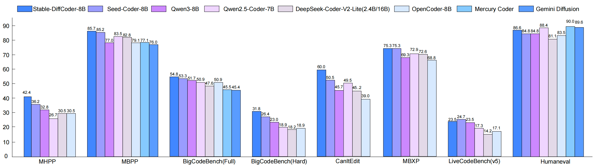

<h1 align="center">
  
  Stable-DiffCoder: Pushing the Frontier of Code Diffusion Large Language Model
</h1>

<p align="center">
🌐 <a href="https://bytedance-seed.github.io/Stable-DiffCoder/"> Homepage</a>&nbsp&nbsp | &nbsp&nbsp🤗 <a href="https://huggingface.co/collections/ByteDance-Seed/stable-diffcoder">Hugging Face</a>&nbsp&nbsp | &nbsp&nbsp📄 <a href="https://arxiv.org/abs/xxx">arXiv</a>
</p>

We are thrilled to introduce **Stable-DiffCoder**, which is a strong code diffusion large language model. Built directly on the **Seed-Coder** architecture, data, and training pipeline, it introduces a block diffusion continual pretraining (CPT) stage with a tailored warmup and block-wise clipped noise schedule.

Under identical architecture and data settings, we systematically analyze and design an efficient diffusion training pipeline that is not only stable but also potentially lifts the model’s performance ceiling. With this recipe, Stable-DiffCoder demonstrates overall performance improvements compared to its autoregressive (AR) counterpart across a broad set of code benchmarks, while any-order modeling improves structured code handling for editing and reasoning, and diffusion-based corruption aids learning for low-resource programming languages. 

Notably, with only CPT followed by supervised fine-tuning, Stable-DiffCoder further surpasses many strong ∼8B AR and diffusion-based code models. These results demonstrate that diffusion-based training can improve code modeling quality beyond what AR training alone can achieve, even under tightly controlled data and architecture constraints.

## 📢 News

[2026/01/12]🔥 We release [Stable-DiffCoder](https://bytedance-stable-diffcoder.github.io)!


---


## ✨ Highlights

* **Fair & controlled comparison**: identical architecture, data, and training pipeline as the AR baseline, isolating the effect of diffusion-based training 
* **Block diffusion CPT**: equipped with a tailored warmup strategy and a block-wise clipped noise schedule
* **Actionable training insights**: systematic analysis of training dynamics, providing practical and efficient guidelines for diffusion-based model training  
* **Strong performance under minimal stages**: competitive with a wide range of ∼8B AR and diffusion-based instruction models using only CPT + SFT  


## ⚡ Quick Start
We are excited to introduce **Stable-DiffCoder**, featuring three powerful models:

| Model Name                  | Length | Download                                                                           |   Notes  |
|-----------------------------|--------|------------------------------------------------------------------------------------|---------------|
| Stable-DiffCoder-8B-Base          | 8K    | 🤗 [Model](https://huggingface.co/ByteDance-Seed/Stable-DiffCoder-8B-Base)        |  Pretrained on our model-centric code data. |
| Stable-DiffCoder-8B-Instruct      | 8K    | 🤗 [Model](https://huggingface.co/ByteDance-Seed/Stable-DiffCoder-8B-Instruct)    |  Instruction-tuned for alignment with user intent.  |


All the models are publicly available on [Hugging Face collection](https://huggingface.co/collections/ByteDance-Seed/stable-diffcoder).  

### 👉🏻 Deploying Stable-DiffCoder-8B-Instruct with `transformers`

```python
# pip install transformers==4.46.2
from transformers import AutoTokenizer, AutoModelForCausalLM
import torch

device = 'cuda'
model = AutoModelForCausalLM.from_pretrained('/opt/tiger/mariana/stable_diffcoder_instruct', trust_remote_code=True, torch_dtype=torch.bfloat16).to(device).eval()
tokenizer = AutoTokenizer.from_pretrained('/opt/tiger/mariana/stable_diffcoder_instruct', trust_remote_code=True)

prompt = 'Write a quick sort algorithm.'
m = [{"role": "user", "content": prompt}, ]
prompt = tokenizer.apply_chat_template(m, add_generation_prompt=True, tokenize=False)
input_ids = tokenizer(prompt)['input_ids']
input_ids = torch.tensor(input_ids).to(device).unsqueeze(0)

out = model.generate(input_ids, steps=512, gen_length=512, block_length=4, temperature=0., remasking='low_confidence', tokenizer=tokenizer, shift=False, threshold=None, eos_id=tokenizer.eos_token_id)
print(tokenizer.decode(out[0][input_ids.shape[1]:], skip_special_tokens=True))
```
For more detailed usage instructions and model-specific configurations, please refer to the Hugging Face model pages linked above.


## 🏆 Performance
We evaluated Stable-DiffCoder across a wide range of coding benchmarks, including code generation, code completion, code editing, code reasoning tasks.

Stable-DiffCoder achieves state-of-the-art performance among open-source models at the 8B scale, and even surpasses some much larger models.



For detailed benchmark results and analysis, please refer to our [Technical Report](./Stable_DiffCoder.pdf).

## 📖 Citation
If you find Stable-DiffCoder useful for your research and applications, feel free to give us a star ⭐ or cite us using:

```bibtex
@misc{seed2026stablediffcoder,
      title={{Stable-DiffCoder}: Pushing the Frontier of Code Diffusion Large Language Model}, 
      author={{ByteDance Seed} and Chenghao Fan and Wen Heng and Bo Li and Sichen Liu and Yuxuan Song and Jing Su and Xiaoye Qu and Kai Shen and Wei Wei},
      year={2026}
}
```

## Contact
If you have any question, feel free to contact 📫 facicofan@gmail.com

## 📜 License
This project is licensed under MIT License. See the [LICENSE](./LICENSE) file for details.

## 🏢 About [ByteDance Seed Team](https://seed.bytedance.com/)

Founded in 2023, ByteDance Seed Team is dedicated to crafting the industry's most advanced AI foundation models. The team aspires to become a world-class research team and make significant contributions to the advancement of science and society.
